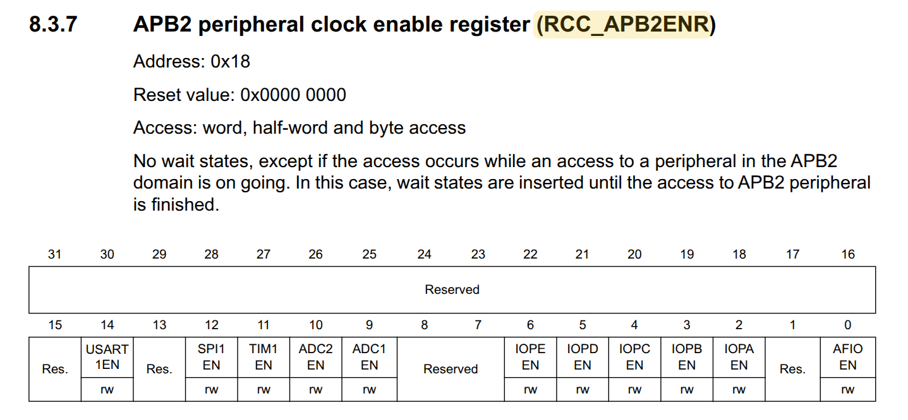
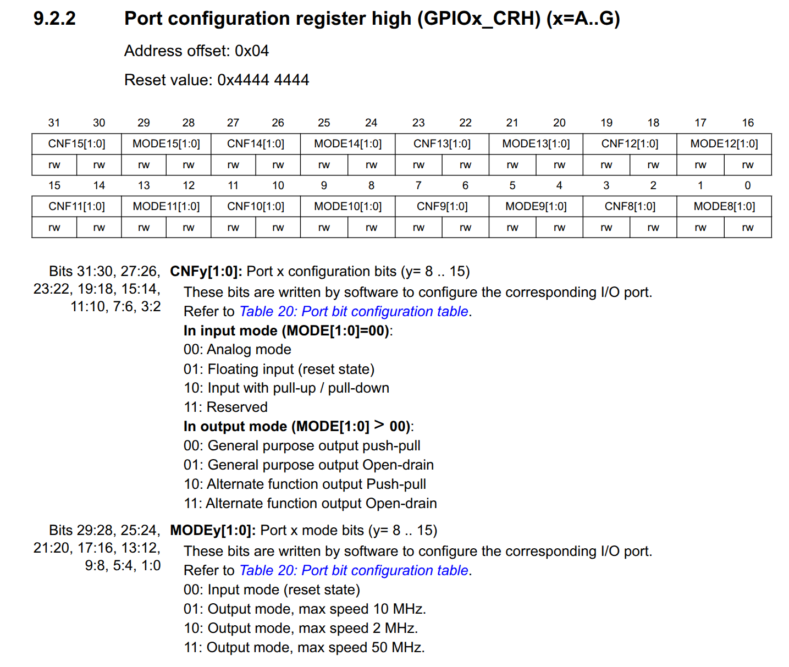
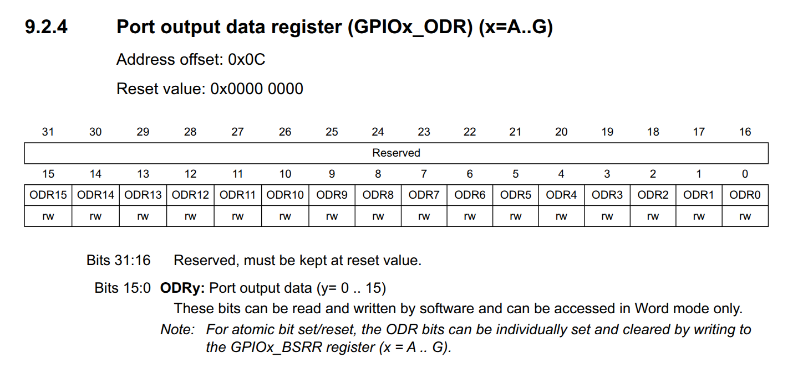

# Bare Blink Application

It blinks the board LED connected to PC13, which means Port C pin 13. On most
Blue Pill boards this LED is active-low: driving PC13 low turns the LED on, and
driving PC13 high turns the LED off.

The application does three things:

1. Enable the GPIOC peripheral clock.
2. Configure PC13 as a general-purpose push-pull output.
3. Toggle PC13 forever, with a busy-wait delay between toggles.

## Micro configuration

### APB2 peripheral clock enable



GPIOC is connected to the APB2 peripheral bus. Before the CPU can safely access
GPIOC registers, the GPIOC peripheral clock must be enabled in `RCC_APB2ENR`.

Code:

```c
RCC_APB2ENR |= RCC_APB2ENR_IOPCEN;
```

Register details:

| Item | Value |
| --- | --- |
| Register | `RCC_APB2ENR` |
| Address | `0x40021018` |
| Bit used | bit 4, `IOPCEN` |
| Mask | `0x00000010` |
| Operation | OR assignment, `|=` |

The operation sets bit 4 and leaves every other bit unchanged.

Assuming the reset value is `0x00000000`:

```text
Before: 0x00000000
Mask:   0x00000010
After:  0x00000010
```

After this, GPIOC is clocked and its configuration/output registers can be used.

### GPIO Port C configuration



Each GPIO pin has a 4-bit configuration field. For pins 8 through 15, those
fields live in `GPIOx_CRH`. Since the LED is on PC13, its configuration field is
inside `GPIOC_CRH`.

PC13 uses bits `23:20` in `GPIOC_CRH`:

```text
CNF13[1:0]  = bits 23:22
MODE13[1:0] = bits 21:20
```

The code first clears the whole 4-bit PC13 field:

```c
GPIOC_CRH &= ~GPIO_CFG_MASK(LED_PIN);
```

Register details:

| Item | Value |
| --- | --- |
| Register | `GPIOC_CRH` |
| Address | `0x40011004` |
| PC13 field | bits `23:20` |
| Field mask | `0x00F00000` |
| Clear mask | `~0x00F00000` |
| Operation | AND assignment, `&=` |

This clears `CNF13[1:0]` and `MODE13[1:0]` to `0000`, while preserving the
configuration fields for the other GPIOC pins.

Assuming the reset value is `0x44444444`:

```text
Before: 0x44444444
Mask:   0xFF0FFFFF
After:  0x44044444
```

Then the code writes the wanted PC13 mode:

```c
GPIOC_CRH |= GPIO_CFG(LED_PIN, GPIO_MODE_OUTPUT_2MHZ, GPIO_CNF_OUTPUT_PP);
```

The selected values are:

| Field | Value | Meaning |
| --- | --- | --- |
| `MODE13[1:0]` | `0b10` | Output mode, max speed 2 MHz |
| `CNF13[1:0]` | `0b00` | General-purpose push-pull output |

Together, the PC13 field becomes `0010`:

```text
CNF13 MODE13
00    10
```

That 4-bit field is shifted into bits `23:20`, giving this value:

```text
GPIO_CFG(13, 0b10, 0b00) = 0x00200000
```

Assuming the previous value was `0x44044444`:

```text
Before: 0x44044444
Mask:   0x00200000
After:  0x44244444
```

At this point, PC13 is configured as a normal digital output pin.

### GPIO Port C output register



Once PC13 is configured as an output, its output level is controlled by bit 13 in
`GPIOC_ODR`, the GPIOC output data register.

Code:

```c
GPIOC_ODR ^= GPIO_PIN(LED_PIN);
```

Register details:

| Item | Value |
| --- | --- |
| Register | `GPIOC_ODR` |
| Address | `0x4001100C` |
| Bit used | bit 13 |
| Mask | `0x00002000` |
| Operation | XOR assignment, `^=` |

XOR toggles the selected bit:

| Previous bit 13 | New bit 13 | PC13 level | LED state |
| --- | --- | --- | --- |
| `0` | `1` | High | Off |
| `1` | `0` | Low | On |

Assuming `GPIOC_ODR` starts at reset value `0x00000000`, the first few toggles
look like this:

```text
Initial:       0x00000000  PC13 low   LED on
First toggle:  0x00002000  PC13 high  LED off
Second toggle: 0x00000000  PC13 low   LED on
Third toggle:  0x00002000  PC13 high  LED off
```

The delay function is just a busy-wait loop. It repeatedly executes `nop`, which
does no useful work but consumes CPU cycles so the LED state remains visible
before the next toggle.
