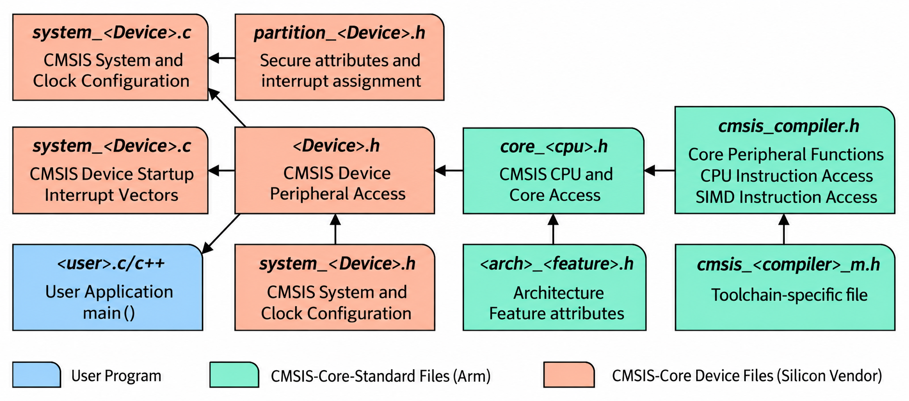

# CMSIS Framework

CMSIS means Cortex Microcontroller Software Interface Standard. It is an ARM
software standard for Cortex-M microcontrollers.

CMSIS is not the same thing as the STM32 HAL. CMSIS is the low-level common
interface around the ARM Cortex core and device description. Vendor libraries,
such as ST HAL or ST LL, can be built on top of CMSIS.

For this project, CMSIS is useful mainly as a reference for how Cortex-M startup,
interrupt names, NVIC access, SysTick access, and device headers are normally
organized.

## Why CMSIS Exists

Different microcontroller vendors use the same ARM Cortex-M CPU cores, but each
vendor has different peripherals, register maps, startup files, and drivers.

CMSIS separates common Cortex-M concepts from vendor-specific device details:

| Layer | Owned by | Example |
| --- | --- | --- |
| Cortex-M core interface | ARM CMSIS | `core_cm3.h`, NVIC helpers, SysTick helpers |
| Device description | Silicon vendor | `stm32f103xb.h`, interrupt numbers, peripheral structs |
| Board/application code | User project | `main.c`, linker script, selected drivers |

That makes code more portable between Cortex-M devices while still allowing each
vendor to describe its own chip.

## Key Components

### CMSIS-Core

CMSIS-Core is the most relevant part for this project.

It provides standardized access to the Cortex-M processor core:

| Feature | Purpose |
| --- | --- |
| Core register definitions | Access CPU/system registers using standard names |
| NVIC functions | Enable, disable, prioritize, and inspect interrupts |
| SysTick definitions | Configure and use the Cortex-M system timer |
| SCB definitions | Access the System Control Block |
| Intrinsics | Use special CPU instructions from C |
| Compiler abstraction | Hide differences between GCC, Arm Compiler, IAR, etc. |

Examples of CMSIS-Core style functions and intrinsics:

```c
__enable_irq();
__disable_irq();
__WFI();
NVIC_EnableIRQ(SysTick_IRQn);
NVIC_SetPriority(SysTick_IRQn, 2u);
```

On this project’s Cortex-M3 target, the central ARM-provided file would be:

```text
core_cm3.h
```

### CMSIS-Driver

CMSIS-Driver defines generic driver APIs for common peripherals such as USART,
SPI, I2C, Ethernet, USB, and storage.

The goal is to let middleware use the same API across different vendors. The
actual implementation still has to be written for the specific microcontroller.

For this learning project, CMSIS-Driver is not needed yet because the code is
direct-register bare metal.

### CMSIS-DSP

CMSIS-DSP is a digital signal processing library optimized for Cortex-M cores.

It includes functions for:

| Area | Examples |
| --- | --- |
| Basic math | vector add, multiply, scale |
| Filters | FIR, IIR, biquad filters |
| Transforms | FFT, DCT |
| Statistics | mean, RMS, variance |
| Matrix math | matrix multiply, inverse, transpose |

It matters when the application does signal processing, audio, sensors, motor
control, or control loops. It is unrelated to simple GPIO blinking.

### CMSIS-NN

CMSIS-NN provides neural-network kernels optimized for Cortex-M processors.

It is used for embedded machine learning inference, especially with quantized
models. It is not relevant for the current blink firmware, but it is part of the
CMSIS ecosystem.

### CMSIS-RTOS

CMSIS-RTOS defines a standard RTOS API. The current version is CMSIS-RTOS2.

It provides common names for RTOS concepts:

| Concept | Example API |
| --- | --- |
| Threads | `osThreadNew()` |
| Delay/time | `osDelay()` |
| Mutexes | `osMutexNew()` |
| Semaphores | `osSemaphoreNew()` |
| Queues | `osMessageQueueNew()` |
| Timers | `osTimerNew()` |

CMSIS-RTOS is an API layer. A real RTOS implementation, such as RTX or a wrapper
around another RTOS, provides the actual scheduler.

This project does not use an RTOS. It starts at `Reset_Handler`, calls `main`,
and stays in a single infinite loop.

### CMSIS-Pack

CMSIS-Pack describes software components, device metadata, examples, startup
files, SVD files, and dependency information in a package format.

An IDE can use packs to know which headers, startup files, flash algorithms, and
debug descriptions belong to a device.

For manual Makefile-based projects like this one, packs are useful as a source of
reference files, but the build does not need to consume packs directly.

### CMSIS-SVD

SVD means System View Description.

An SVD file is an XML description of a microcontroller’s peripherals, registers,
fields, reset values, and bit meanings. Debuggers and IDEs use SVD files to show
peripheral registers by name instead of only raw addresses.

For example, an SVD lets a debugger show:

```text
RCC.APB2ENR.IOPCEN = 1
GPIOC.CRH.MODE13 = 0b10
GPIOC.ODR.ODR13 = 1
```

instead of only:

```text
0x40021018 = 0x00000010
0x40011004 = 0x44244444
0x4001100C = 0x00002000
```

SVD files are excellent for debugging and for checking register definitions.

## CMSIS Coding Rules

CMSIS is designed to work across compilers and vendors, so it follows stricter
coding rules than a small single-project header usually needs.

### ANSI C

CMSIS headers are written in portable C. They avoid relying on one vendor’s C
dialect where possible.

The goal is that the same CMSIS-Core header can work with GCC, Arm Compiler,
IAR, and other embedded toolchains.

### Standard Integer Types

CMSIS uses fixed-width integer types from `<stdint.h>`:

```c
uint32_t
int32_t
uint16_t
uint8_t
```

This matters in register programming. A peripheral register is normally 32 bits,
so the code should say `uint32_t`, not plain `int` or `long`, because those types
can vary between platforms.

This project already follows that style in `include/stm32f103c8t6.h` and the
startup code.

### CMSIS Data Types

CMSIS commonly defines peripheral registers through C structs containing
`volatile` fields. A simplified example looks like this:

```c
typedef struct {
  volatile uint32_t CR;
  volatile uint32_t CFGR;
  volatile uint32_t CIR;
  volatile uint32_t APB2RSTR;
  volatile uint32_t APB1RSTR;
  volatile uint32_t AHBENR;
  volatile uint32_t APB2ENR;
} RCC_TypeDef;
```

Then a peripheral base address is cast to that type:

```c
#define RCC ((RCC_TypeDef *)0x40021000UL)
```

So code can use:

```c
RCC->APB2ENR |= (1u << 4);
```

This project currently uses simpler register macros instead:

```c
#define RCC_APB2ENR RCC_REG(RCC_APB2ENR_OFFSET)
```

Both styles access the same hardware. The struct style is the common CMSIS device
header style. The macro style is smaller and easier to inspect while learning.

### Volatile Register Access

Hardware registers must be accessed through `volatile` qualified objects.

Without `volatile`, the compiler may remove or reorder reads/writes because it
does not know that an address controls hardware.

This project’s register helper does that:

```c
#define STM32_REG32(addr) (*(volatile uint32_t *)(uintptr_t)(addr))
```

### Compiler Abstraction

Different compilers spell special attributes and intrinsics differently. CMSIS
hides those differences behind common macros.

For example, CMSIS has compiler-specific headers such as:

```text
cmsis_gcc.h
cmsis_armclang.h
cmsis_iccarm.h
```

Those files define compiler-specific details for inline assembly, packed structs,
weak symbols, barriers, and special instructions.

This project currently uses GCC directly:

```c
__attribute__((weak, alias("Default_Handler")))
```

That is fine for this Makefile/GCC project, but less portable than CMSIS compiler
abstraction.

### MISRA C Considerations

MISRA C is a set of rules for writing safer C in embedded and critical systems.
CMSIS aims to be usable in projects that care about MISRA, but direct hardware
access often requires carefully documented rule deviations.

Common embedded deviations include:

| Pattern | Why it appears |
| --- | --- |
| Integer-to-pointer casts | Needed to map fixed hardware addresses to register objects |
| `volatile` accesses | Needed for hardware registers changed outside normal program flow |
| Weak symbols | Needed for overrideable interrupt handlers |
| Compiler attributes | Needed for sections, packing, alignment, interrupt behavior |

For a learning project, the main lesson is not to avoid these patterns. The main
lesson is to keep them centralized, explicit, and easy to audit.

## CMSIS-Core File Structure

The CMSIS-Core structure is usually split into three groups:

1. CMSIS-Core standard files from ARM.
2. CMSIS-Core device files from the silicon vendor.
3. User program files from the application project.

## CMSIS-Core Files



The image shows that application code does not include random low-level files
directly. Instead, the user program includes the device header, and the device
header includes the correct Cortex-M core header.

### CMSIS-Core Standard Files

These files come from ARM CMSIS and describe the processor core, not a specific
STM32/CKS chip.

For Cortex-M3, the key file is:

```text
core_cm3.h
```

It depends on compiler support headers such as:

```text
cmsis_compiler.h
cmsis_gcc.h
cmsis_version.h
```

These files provide:

| File role | Purpose |
| --- | --- |
| Core header | Cortex-M3 registers and core peripherals |
| Compiler header | Compiler-specific attributes and intrinsics |
| Version header | CMSIS version identification |

The core header knows about ARM core peripherals such as NVIC, SysTick, and SCB.
It does not know about STM32 GPIOC or RCC register layout.

### CMSIS-Core Device Files

These files come from the microcontroller vendor.

For an STM32F103-style device, typical files are:

```text
stm32f103xb.h
system_stm32f1xx.h
system_stm32f1xx.c
startup_stm32f103xb.s
```

The device header usually provides:

| Item | Example |
| --- | --- |
| IRQ numbers | `SysTick_IRQn`, `EXTI0_IRQn`, `USART1_IRQn` |
| Peripheral base addresses | `RCC_BASE`, `GPIOC_BASE` |
| Peripheral structs | `RCC_TypeDef`, `GPIO_TypeDef` |
| Peripheral pointer macros | `RCC`, `GPIOC` |
| Register bit definitions | `RCC_APB2ENR_IOPCEN` |

The system file usually provides:

```c
void SystemInit(void);
```

In vendor projects, `SystemInit()` configures the clock tree before `main`.

This project has its own minimal version:

```text
src/system_stm32f103.c
```

The startup file provides the vector table and reset handler. This project uses a
C startup file instead of the vendor assembly startup:

```text
src/startup_stm32f103.c
```

### User Program Files

User program files are the application and project-specific files.

In this project, examples are:

```text
apps/bare-blink/main.c
include/stm32f103c8t6.h
linker/STM32F103C8TX_FLASH.ld
src/startup_stm32f103.c
src/system_stm32f103.c
```

The current project deliberately uses a small custom device header:

```text
include/stm32f103c8t6.h
```

That header is not a full CMSIS device header. It is a small register map written
for learning direct register programming.

## CMSIS, HAL, And LL

CMSIS is often confused with vendor drivers. They are related, but they are not
the same layer.

| Layer | What it provides | Example |
| --- | --- | --- |
| CMSIS-Core | ARM Cortex-M core access | `NVIC_EnableIRQ()` |
| CMSIS device header | Vendor chip definitions | `RCC`, `GPIOC`, IRQ numbers |
| LL driver | Thin vendor peripheral helpers | `LL_GPIO_SetPinMode()` |
| HAL driver | Higher-level vendor peripheral API | `HAL_GPIO_WritePin()` |

For learning bare-metal behavior, CMSIS-Core and CMSIS device headers are useful.
HAL is convenient but hides many register-level details.

## STM32 Clone Considerations

This project targets an STM32F103C8T6-style Blue Pill board, but clone chips may
not match ST silicon perfectly.

CMSIS-Core is safe to use because it describes the ARM Cortex-M3 core. The core
behavior is standardized by ARM.

STM32F103 device headers are useful, but they describe ST’s device. A clone such
as a CKS32F103-compatible part may differ in details such as debug ID, Flash
programming behavior, electrical characteristics, or undocumented registers.

For this reason, the safest approach for this project is:

1. Keep using the clone datasheet and local memory-map document as the silicon reference.
2. Use ST/CMSIS headers as reference material, not as unquestioned truth.
3. Add only the register definitions needed by the project.
4. Keep include paths explicit in the Makefile instead of relying on broad global `CPATH` behavior.
5. Avoid AI-generated headers as authoritative source files.

AI is useful for explanations and review, but register definitions should be
checked against vendor documentation, CMSIS headers, SVD files, and real hardware
behavior.

## How CMSIS Could Fit This Project

A conservative migration path would be:

1. Keep the current direct-register learning code.
2. Add CMSIS-Core only when standard Cortex-M helpers are useful.
3. Optionally add an STM32F1 CMSIS device header as a reference or alternate path.
4. Keep HAL out until the goal shifts from learning registers to building features quickly.

The first useful CMSIS-Core features for this project would probably be:

```c
__enable_irq();
__disable_irq();
__WFI();
NVIC_EnableIRQ(...);
NVIC_SetPriority(...);
```

Those become useful once the project adds timers, SysTick, EXTI, USART, or other
interrupt-driven code.

## References

CMSIS documentation:
<https://arm-software.github.io/CMSIS_6/latest/General/index.html>

CMSIS-Core documentation:
<https://arm-software.github.io/CMSIS_6/latest/Core/index.html>

CMSIS-Driver documentation:
<https://arm-software.github.io/CMSIS_6/latest/Driver/index.html>

CMSIS-DSP documentation:
<https://arm-software.github.io/CMSIS-DSP/latest/>

CMSIS-NN repository:
<https://github.com/ARM-software/CMSIS-NN>

CMSIS-RTOS2 documentation:
<https://arm-software.github.io/CMSIS_6/latest/RTOS2/index.html>

CMSIS-Pack documentation:
<https://open-cmsis-pack.github.io/Open-CMSIS-Pack-Spec/main/html/index.html>

CMSIS-SVD specification:
<https://arm-software.github.io/CMSIS_6/latest/SVD/html/index.html>

MISRA C overview:
<https://misra.org.uk/>
