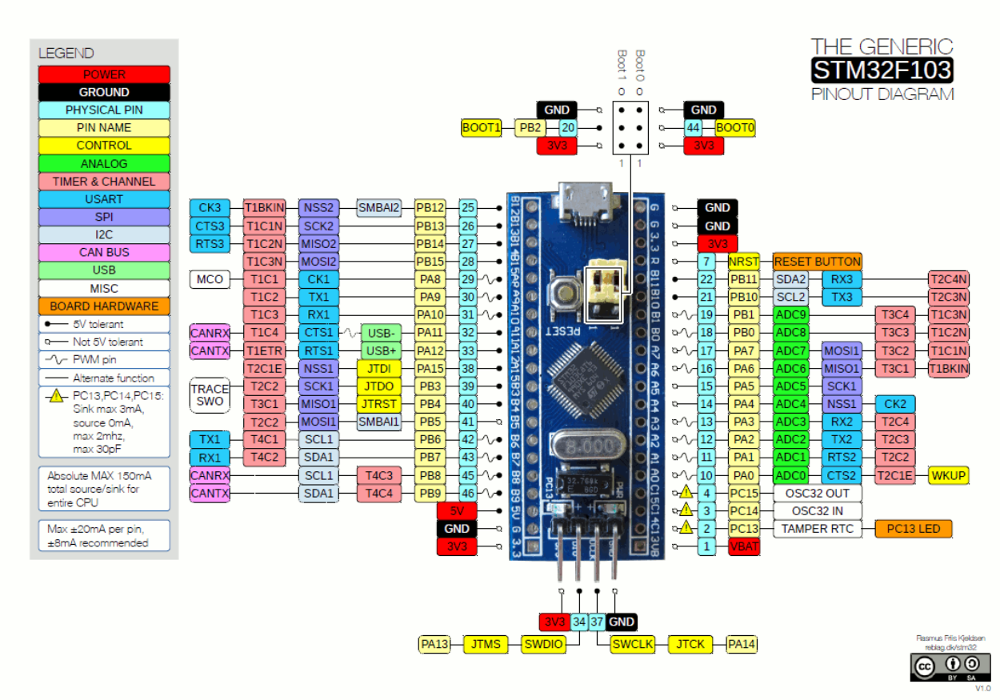

# STM32F103C8T6 Pinout

The STM32F103C8T6 uses the medium-density STM32F103x8 pin definition for its
48-pin LQFP package. A physical pin can have a GPIO name, a peripheral function,
and one or more remapped functions. Only one function can control a pin at a
time.

The diagram is a practical board reference. The table below is the authoritative
LQFP48 mapping for the STM32F103x8 datasheet. `FT` means the digital input is
5 V-tolerant. Each GPIO and peripheral section includes the clocks and the GPIO
`CNF`/`MODE` values needed for the signals in that section. Here, `MODE=11`
means an output at 50 MHz, `CNF=10` means alternate-function push-pull,
`CNF=11` means alternate-function open-drain, `MODE=00,CNF=01` is a floating
input, and `MODE=00,CNF=00` is an analog input.

## Boot Pins

These pins affect boot selection. `BOOT0` is sampled at reset. `PB2` is also
labelled `BOOT1` and is used with `BOOT0` by the system boot configuration.

| Pin name    | Type / I/O level | Main function after reset | Alternate functions |
| ----------- | ---------------- | ------------------------- | ------------------- |
| `PB2/BOOT1` | I/O, FT          | `PB2/BOOT1`               | -                   |
| `BOOT0`     | I                | `BOOT0`                   | -                   |

## Voltage Pins

Supply and ground pins are not GPIOs. Connect every required supply and ground
pin according to the board design; do not use these entries as signal pins.

| Pin name | Type / I/O level | Main function after reset | Alternate functions |
| -------- | ---------------- | ------------------------- | ------------------- |
| `VBAT`   | S                | `VBAT`                    | -                   |
| `VSSA`   | S                | `VSSA`                    | -                   |
| `VDDA`   | S                | `VDDA`                    | -                   |
| `VSS_1`  | S                | `VSS_1`                   | -                   |
| `VDD_1`  | S                | `VDD_1`                   | -                   |
| `VSS_2`  | S                | `VSS_2`                   | -                   |
| `VDD_2`  | S                | `VDD_2`                   | -                   |
| `VSS_3`  | S                | `VSS_3`                   | -                   |
| `VDD_3`  | S                | `VDD_3`                   | -                   |

## GPIO And Special Functions

The remaining bonded pins are grouped first by GPIO port, then by peripheral.
The GPIO tables retain the datasheet's complete pin metadata. The special
function tables are cross-references, so the same physical pin can appear in
more than one peripheral group.

### GPIOA

<ul>
<li>GPIO bus: APB2, <code>RCC_APB2ENR_IOPAEN</code>.</li>
<li>Alternate-function remap: APB2, <code>RCC_APB2ENR_AFIOEN</code> when needed.</li>
<li>Peripheral clocks depend on the selected function: USART1, SPI1, TIM1 on APB2; USART2, TIM2, and TIM3 on APB1.</li>
</ul>

| Pin name | Type / I/O level | Main function after reset | Alternate functions | CNF/MODE |
| --- | --- | --- | --- | --- |
| `PA0-WKUP` | I/O | `PA0` | <ul><li>`WKUP`</li><li>`USART2_CTS`</li><li>`ADC12_IN0`</li><li>`TIM2_CH1_ETR`</li></ul> | <ul><li>WKUP/USART2_CTS/TIM2 input: `MODE=00, CNF=01`</li><li>ADC: `MODE=00, CNF=00`</li></ul> |
| `PA1` | I/O | `PA1` | <ul><li>`USART2_RTS`</li><li>`ADC12_IN1`</li><li>`TIM2_CH2`</li></ul> | <ul><li>USART2_RTS/TIM2 output: `MODE=11, CNF=10`</li><li>ADC: `MODE=00, CNF=00`</li></ul> |
| `PA2` | I/O | `PA2` | <ul><li>`USART2_TX`</li><li>`ADC12_IN2`</li><li>`TIM2_CH3`</li></ul> | <ul><li>USART2_TX/TIM2 output: `MODE=11, CNF=10`</li><li>ADC: `MODE=00, CNF=00`</li></ul> |
| `PA3` | I/O | `PA3` | <ul><li>`USART2_RX`</li><li>`ADC12_IN3`</li><li>`TIM2_CH4`</li></ul> | <ul><li>USART2_RX input: `MODE=00, CNF=01`</li><li>ADC: `MODE=00, CNF=00`</li></ul> |
| `PA4` | I/O | `PA4` | <ul><li>`SPI1_NSS`</li><li>`USART2_CK`</li><li>`ADC12_IN4`</li></ul> | <ul><li>SPI1_NSS/USART2_CK output: `MODE=11, CNF=10`</li><li>ADC: `MODE=00, CNF=00`</li></ul> |
| `PA5` | I/O | `PA5` | <ul><li>`SPI1_SCK`</li><li>`ADC12_IN5`</li></ul> | <ul><li>SPI1_SCK output: `MODE=11, CNF=10`</li><li>ADC: `MODE=00, CNF=00`</li></ul> |
| `PA6` | I/O | `PA6` | <ul><li>`SPI1_MISO`</li><li>`ADC12_IN6`</li><li>`TIM3_CH1`</li><li>Remap: `TIM1_BKIN`</li></ul> | <ul><li>SPI1_MISO/TIM1_BKIN input: `MODE=00, CNF=01`</li><li>TIM3_CH1 output: `MODE=11, CNF=10`</li><li>ADC: `MODE=00, CNF=00`</li></ul> |
| `PA7` | I/O | `PA7` | <ul><li>`SPI1_MOSI`</li><li>`ADC12_IN7`</li><li>`TIM3_CH2`</li><li>Remap: `TIM1_CH1N`</li></ul> | <ul><li>SPI1_MOSI/TIM3_CH2/TIM1_CH1N output: `MODE=11, CNF=10`</li><li>ADC: `MODE=00, CNF=00`</li></ul> |
| `PA8` | I/O, FT | `PA8` | <ul><li>`USART1_CK`</li><li>`TIM1_CH1`</li><li>`MCO`</li></ul> | <ul><li>All output: `MODE=11, CNF=10`</li></ul> |
| `PA9` | I/O, FT | `PA9` | <ul><li>`USART1_TX`</li><li>`TIM1_CH2`</li></ul> | <ul><li>All output: `MODE=11, CNF=10`</li></ul> |
| `PA10` | I/O, FT | `PA10` | <ul><li>`USART1_RX`</li><li>`TIM1_CH3`</li></ul> | <ul><li>USART1_RX input: `MODE=00, CNF=01`</li><li>TIM1_CH3 output: `MODE=11, CNF=10`</li></ul> |
| `PA11` | I/O, FT | `PA11` | <ul><li>`USART1_CTS`</li><li>`CANRX`</li><li>`USBDM`</li><li>`TIM1_CH4`</li></ul> | <ul><li>USART1_CTS/CANRX input: `MODE=00, CNF=01`</li><li>USBDM/TIM1_CH4 output: `MODE=11, CNF=10`</li></ul> |
| `PA12` | I/O, FT | `PA12` | <ul><li>`USART1_RTS`</li><li>`CANTX`</li><li>`USBDP`</li><li>Remap: `TIM1_ETR`</li></ul> | <ul><li>USART1_RTS/CANTX/USBDP output: `MODE=11, CNF=10`</li><li>TIM1_ETR input: `MODE=00, CNF=01`</li></ul> |
| `PA13` | I/O, FT | `JTMS/SWDIO` | <ul><li>Remap: `PA13`</li></ul> | Debug controller owns the pin; do not configure as GPIO. |
| `PA14` | I/O, FT | `JTCK/SWCLK` | <ul><li>Remap: `PA14`</li></ul> | Debug controller owns the pin; do not configure as GPIO. |
| `PA15` | I/O, FT | `JTDI` | <ul><li>Remap: `TIM2_CH1_ETR`</li><li>Remap: `PA15`</li><li>Remap: `SPI1_NSS`</li></ul> | <ul><li>TIM2_CH1/ETR input: `MODE=00, CNF=01`</li><li>SPI1_NSS output: `MODE=11, CNF=10`</li></ul> |

**Incompatibilities**

<ul>
<li><code>PA0-PA3</code> cannot simultaneously be used by USART2, ADC channels, TIM2, or GPIO.</li>
<li><code>PA4-PA7</code> cannot simultaneously be used by SPI1, ADC channels, USART2_CK, or TIM3.</li>
<li><code>PA6</code> and <code>PA7</code> also conflict with remapped TIM1 BKIN/CH1N.</li>
<li><code>PA8-PA12</code> are shared by USART1, TIM1, and MCO/CAN/USB functions; only one owner can be selected per pin.</li>
<li>Using USB on <code>PA11/PA12</code> prevents default CAN, USART1 CTS/RTS, and TIM1 CH4/ETR use.</li>
<li><code>PA13/PA14</code> remain owned by SWD; reclaiming them requires disabling the debug interface.</li>
<li>Remapped <code>PA15</code> functions require JTAG to be disabled and conflict with other TIM2 or SPI1 remaps.</li>
</ul>

### GPIOB

<ul>
<li>GPIO bus: APB2, <code>RCC_APB2ENR_IOPBEN</code>.</li>
<li>Alternate-function remap: APB2, <code>RCC_APB2ENR_AFIOEN</code> when needed.</li>
<li>Peripheral clocks depend on the selected function: SPI2, I2C1/I2C2, TIM1, TIM2, TIM3, TIM4, USART1, and USART3.</li>
</ul>

| Pin name | Type / I/O level | Main function after reset | Alternate functions | CNF/MODE |
| --- | --- | --- | --- | --- |
| `PB0` | I/O | `PB0` | <ul><li>`ADC12_IN8`</li><li>`TIM3_CH3`</li><li>Remap: `TIM1_CH2N`</li></ul> | <ul><li>ADC: `MODE=00, CNF=00`</li><li>TIM3/TIM1 output: `MODE=11, CNF=10`</li></ul> |
| `PB1` | I/O | `PB1` | <ul><li>`ADC12_IN9`</li><li>`TIM3_CH4`</li><li>Remap: `TIM1_CH3N`</li></ul> | <ul><li>ADC: `MODE=00, CNF=00`</li><li>TIM3/TIM1 output: `MODE=11, CNF=10`</li></ul> |
| `PB2/BOOT1` | I/O, FT | `PB2/BOOT1` | - | Boot controller owns the boot function; GPIO input if repurposed: `MODE=00, CNF=01`. |
| `PB3` | I/O, FT | `JTDO` | <ul><li>Remap: `TIM2_CH2`</li><li>Remap: `PB3`</li><li>Remap: `TRACESWO`</li></ul> | <ul><li>Timer/SWO output: `MODE=11, CNF=10`</li><li>Debug controller owns the JTAG function.</li></ul> |
| `PB4` | I/O, FT | `JNTRST` | <ul><li>Remap: `TIM3_CH1`</li><li>Remap: `PB4`</li><li>Remap: `SPI1_MISO`</li></ul> | <ul><li>Timer output: `MODE=11, CNF=10`</li><li>SPI1_MISO input: `MODE=00, CNF=01`</li><li>Debug controller owns JTAG.</li></ul> |
| `PB5` | I/O | `PB5` | <ul><li>`I2C1_SMBAI`</li><li>Remap: `SPI1_MOSI`</li></ul> | <ul><li>I2C input/open-drain bus: `MODE=11, CNF=11`</li><li>SPI1_MOSI output: `MODE=11, CNF=10`</li></ul> |
| `PB6` | I/O, FT | `PB6` | <ul><li>`I2C1_SCL`</li><li>`TIM4_CH1`</li><li>Remap: `USART1_TX`</li></ul> | <ul><li>I2C SCL: `MODE=11, CNF=11`</li><li>TIM4/USART1 output: `MODE=11, CNF=10`</li></ul> |
| `PB7` | I/O, FT | `PB7` | <ul><li>`I2C1_SDA`</li><li>`TIM4_CH2`</li><li>Remap: `USART1_RX`</li></ul> | <ul><li>I2C SDA: `MODE=11, CNF=11`</li><li>TIM4 output: `MODE=11, CNF=10`</li><li>USART1_RX input: `MODE=00, CNF=01`</li></ul> |
| `PB8` | I/O, FT | `PB8` | <ul><li>`TIM4_CH3`</li><li>Remap: `I2C1_SCL`</li><li>Remap: `CANRX`</li></ul> | <ul><li>TIM4 output: `MODE=11, CNF=10`</li><li>I2C SCL: `MODE=11, CNF=11`</li><li>CANRX input: `MODE=00, CNF=01`</li></ul> |
| `PB9` | I/O, FT | `PB9` | <ul><li>`TIM4_CH4`</li><li>Remap: `I2C1_SDA`</li><li>Remap: `CANTX`</li></ul> | <ul><li>TIM4 output: `MODE=11, CNF=10`</li><li>I2C SDA: `MODE=11, CNF=11`</li><li>CANTX output: `MODE=11, CNF=10`</li></ul> |
| `PB10` | I/O, FT | `PB10` | <ul><li>`I2C2_SCL`</li><li>`USART3_TX`</li><li>Remap: `TIM2_CH3`</li></ul> | <ul><li>I2C SCL: `MODE=11, CNF=11`</li><li>USART3/TIM2 output: `MODE=11, CNF=10`</li></ul> |
| `PB11` | I/O, FT | `PB11` | <ul><li>`I2C2_SDA`</li><li>`USART3_RX`</li><li>Remap: `TIM2_CH4`</li></ul> | <ul><li>I2C SDA: `MODE=11, CNF=11`</li><li>USART3_RX input: `MODE=00, CNF=01`</li><li>TIM2 output: `MODE=11, CNF=10`</li></ul> |
| `PB12` | I/O, FT | `PB12` | <ul><li>`SPI2_NSS`</li><li>`I2C2_SMBAI`</li><li>`USART3_CK`</li><li>`TIM1_BKIN`</li></ul> | <ul><li>SPI2/USART3 output: `MODE=11, CNF=10`</li><li>I2C input/open-drain bus: `MODE=11, CNF=11`</li><li>TIM1_BKIN input: `MODE=00, CNF=01`</li></ul> |
| `PB13` | I/O, FT | `PB13` | <ul><li>`SPI2_SCK`</li><li>`USART3_CTS`</li><li>`TIM1_CH1N`</li></ul> | <ul><li>SPI2/TIM1 output: `MODE=11, CNF=10`</li><li>USART3_CTS input: `MODE=00, CNF=01`</li></ul> |
| `PB14` | I/O, FT | `PB14` | <ul><li>`SPI2_MISO`</li><li>`USART3_RTS`</li><li>Remap: `TIM1_CH2N`</li></ul> | <ul><li>SPI2_MISO/USART3_RTS input: `MODE=00, CNF=01`</li><li>TIM1 output: `MODE=11, CNF=10`</li></ul> |
| `PB15` | I/O, FT | `PB15` | <ul><li>`SPI2_MOSI`</li><li>Remap: `TIM1_CH3N`</li></ul> | <ul><li>SPI2/TIM1 output: `MODE=11, CNF=10`</li></ul> |

**Incompatibilities**

<ul>
<li><code>PB0/PB1</code> cannot simultaneously be ADC12_IN8/IN9, TIM3 channels, remapped TIM1 complementary outputs, or GPIO.</li>
<li><code>PB2</code> is sampled as BOOT1 during reset; changing its GPIO use must not disturb the required boot state.</li>
<li><code>PB3/PB4</code> are JTAG pins after reset and require JTAG disable before use by remapped SPI1 or timers.</li>
<li><code>PB5</code> is shared by I2C1 SMBAI, remapped SPI1 MOSI, and remapped TIM3 CH2.</li>
<li><code>PB6/PB7</code> cannot combine default I2C1, TIM4, and remapped USART1 TX/RX.</li>
<li><code>PB8/PB9</code> cannot combine TIM4, remapped I2C1, and remapped CAN.</li>
<li><code>PB10/PB11</code> cannot combine I2C2, USART3, and remapped TIM2 CH3/CH4.</li>
<li><code>PB12-PB15</code> are shared by SPI2, USART3 synchronous/flow-control signals, and TIM1 break/complementary functions.</li>
</ul>

### GPIOC

<ul>
<li>GPIO bus: APB2, <code>RCC_APB2ENR_IOPCEN</code>.</li>
<li>Backup-domain and oscillator functions do not use a peripheral APB bus; configure the related backup or RCC registers.</li>
</ul>

| Pin name | Type / I/O level | Main function after reset | Alternate functions | CNF/MODE |
| --- | --- | --- | --- | --- |
| `PC13-TAMPER-RTC` | I/O | `PC13` | <ul><li>`TAMPER-RTC`</li></ul> | Tamper/RTC owns the function; GPIO output is limited to `MODE=10, CNF=00`. |
| `PC14-OSC32_IN` | I/O | `PC14` | <ul><li>`OSC32_IN`</li></ul> | Oscillator owns the function; do not configure as GPIO while LSE is enabled. |
| `PC15-OSC32_OUT` | I/O | `PC15` | <ul><li>`OSC32_OUT`</li></ul> | Oscillator owns the function; do not configure as GPIO while LSE is enabled. |

**Incompatibilities**

<ul>
<li><code>PC13</code> cannot provide GPIO output and TAMPER-RTC simultaneously; its output is limited to 2 MHz and low current.</li>
<li><code>PC14/PC15</code> cannot be used as GPIO while the external low-speed oscillator owns them.</li>
</ul>

### GPIOD

<ul>
<li>GPIO bus: APB2, <code>RCC_APB2ENR_IOPDEN</code>.</li>
<li>PD0/PD1 are oscillator pins after reset; enable AFIO on APB2 before remapping them to GPIO.</li>
</ul>

| Pin name | Type / I/O level | Main function after reset | Alternate functions | CNF/MODE |
| --- | --- | --- | --- | --- |
| `PD0-OSC_IN` | I | `OSC_IN` | <ul><li>Remap: `PD0`</li></ul> | GPIO input after remap: `MODE=00, CNF=01`. |
| `PD1-OSC_OUT` | O | `OSC_OUT` | <ul><li>Remap: `PD1`</li></ul> | GPIO output after remap: `MODE=11, CNF=00`. |

**Incompatibilities**

<ul>
<li><code>PD0/PD1</code> cannot be used as GPIO while the external high-speed oscillator owns them.</li>
<li>The USART2 and USART3 remaps involving other PD pins are not bonded on the LQFP48 package.</li>
</ul>

### Reset And Clock Pins

<ul>
<li>GPIO clocks: APB2 port clock for the selected GPIO.</li>
<li>AFIO: APB2, <code>RCC_APB2ENR_AFIOEN</code> for remapping or debug configuration.</li>
<li>Oscillator and reset control additionally use RCC and backup-domain registers, not a peripheral APB clock.</li>
</ul>

| Function | Pin | Notes | CNF/MODE |
| --- | --- | --- | --- |
| Reset | `NRST` | External reset input. | Reset controller owns the pin. |
| Low-speed oscillator input | `PC14-OSC32_IN` | `OSC32_IN` after reset. | Oscillator owns the pin. |
| Low-speed oscillator output | `PC15-OSC32_OUT` | `OSC32_OUT` after reset. | Oscillator owns the pin. |
| High-speed oscillator input | `PD0-OSC_IN` | GPIO `PD0` requires remapping. | GPIO input after remap: `MODE=00, CNF=01`. |
| High-speed oscillator output | `PD1-OSC_OUT` | GPIO `PD1` requires remapping. | GPIO output after remap: `MODE=11, CNF=00`. |
| Wakeup | `PA0-WKUP` | `WKUP` alternate function. | Input: `MODE=00, CNF=01`. |
| Tamper/RTC | `PC13-TAMPER-RTC` | `TAMPER-RTC` alternate function. | GPIO output, if used: `MODE=10, CNF=00`. |

**Incompatibilities**

<ul>
<li><code>NRST</code> is owned by the reset controller and is not an ordinary GPIO.</li>
<li>Using <code>PC14/PC15</code> for the low-speed oscillator prevents their GPIO use.</li>
<li>Using <code>PD0/PD1</code> for the high-speed oscillator prevents their GPIO use until the oscillator is remapped or disabled.</li>
<li><code>PA0</code> cannot simultaneously be the wakeup input, USART2 CTS, ADC12_IN0, TIM2 CH1/ETR, and GPIO.</li>
</ul>

### USART1

<ul>
<li>Peripheral bus: APB2, <code>RCC_APB2ENR_USART1EN</code>.</li>
<li>GPIO port bus: APB2 clock for GPIOA or GPIOB, depending on default or remapped pins.</li>
<li>AFIO/remap: APB2, <code>RCC_APB2ENR_AFIOEN</code> for PB6/PB7 remapping.</li>
</ul>

| Signal | Default pin | Remapped pin | CNF/MODE |
| --- | --- | --- | --- |
| `USART1_CK` | PA8 | - | Output: `MODE=11, CNF=10`. |
| `USART1_TX` | PA9 | PB6 | Output: `MODE=11, CNF=10`. |
| `USART1_RX` | PA10 | PB7 | Input: `MODE=00, CNF=01`. |
| `USART1_CTS` | PA11 | - | Input: `MODE=00, CNF=01`. |
| `USART1_RTS` | PA12 | - | Output: `MODE=11, CNF=10`. |

**Incompatibilities**

<ul>
<li>Default USART1 TX/RX on <code>PA9/PA10</code> conflict with TIM1 CH2/CH3.</li>
<li>Remapped USART1 TX/RX on <code>PB6/PB7</code> conflict with default I2C1 SCL/SDA and TIM4 CH1/CH2.</li>
<li>USART1 CTS/RTS on <code>PA11/PA12</code> conflict with CAN, USB, and TIM1 functions.</li>
<li>USART1 CK on <code>PA8</code> conflicts with TIM1 CH1 and MCO when synchronous clock output is enabled.</li>
<li>Asynchronous USART1 TX/RX does not require CK, CTS, or RTS; unused optional signals can remain unassigned.</li>
</ul>

### USART2

<ul>
<li>Peripheral bus: APB1, <code>RCC_APB1ENR_USART2EN</code>.</li>
<li>GPIO port bus: APB2, GPIOA clock <code>RCC_APB2ENR_IOPAEN</code>.</li>
<li>AFIO/remap: APB2, <code>RCC_APB2ENR_AFIOEN</code> if a remap is selected.</li>
</ul>

| Signal | Pin | CNF/MODE |
| --- | --- | --- |
| `USART2_CTS` | PA0 | Input: `MODE=00, CNF=01`. |
| `USART2_RTS` | PA1 | Output: `MODE=11, CNF=10`. |
| `USART2_TX` | PA2 | Output: `MODE=11, CNF=10`. |
| `USART2_RX` | PA3 | Input: `MODE=00, CNF=01`. |
| `USART2_CK` | PA4 | Output: `MODE=11, CNF=10`. |

**Incompatibilities**

<ul>
<li>USART2 uses <code>PA0-PA4</code>, so the corresponding ADC channels and TIM2 channels cannot use those pins at the same time.</li>
<li>USART2 remapping to PD3-PD7 is not available on the LQFP48 package.</li>
<li>For asynchronous operation, CK, CTS, and RTS are optional; TX/RX can be used without occupying their optional signal pins.</li>
</ul>

### USART3

<ul>
<li>Peripheral bus: APB1, <code>RCC_APB1ENR_USART3EN</code>.</li>
<li>GPIO port bus: APB2 GPIOB for the default LQFP48 pins.</li>
<li>AFIO/remap: APB2, <code>RCC_APB2ENR_AFIOEN</code>; the PD8-PD12 remap is not bonded on LQFP48.</li>
</ul>

| Signal | Default pin | Remapped pin | CNF/MODE |
| --- | --- | --- | --- |
| `USART3_TX` | PB10 | PD8, not bonded on LQFP48 | Output: `MODE=11, CNF=10`. |
| `USART3_RX` | PB11 | PD9, not bonded on LQFP48 | Input: `MODE=00, CNF=01`. |
| `USART3_CK` | PB12 | PD10, not bonded on LQFP48 | Output: `MODE=11, CNF=10`. |
| `USART3_CTS` | PB13 | PD11, not bonded on LQFP48 | Input: `MODE=00, CNF=01`. |
| `USART3_RTS` | PB14 | PD12, not bonded on LQFP48 | Output: `MODE=11, CNF=10`. |

**Incompatibilities**

<ul>
<li>USART3 default TX/RX on <code>PB10/PB11</code> conflict with I2C2 and remapped TIM2 CH3/CH4.</li>
<li>USART3 CK/CTS/RTS on <code>PB12-PB14</code> conflict with SPI2 and TIM1 functions when those optional signals are enabled.</li>
<li>USART3 remapped PD8-PD12 signals are not bonded on LQFP48.</li>
<li>Asynchronous USART3 TX/RX does not require CK, CTS, or RTS.</li>
</ul>

### ADC1 And ADC2

<ul>
<li>Peripheral bus: APB2, <code>RCC_APB2ENR_ADC1EN</code> and/or <code>ADC2EN</code>.</li>
<li>GPIO port bus: APB2 GPIOA or GPIOB clock for the selected channel.</li>
<li>AFIO is not needed for the ADC channel selection.</li>
</ul>

The `ADC12_INx` names identify channels shared by ADC1 and ADC2. The available
LQFP48 analog channels are:

| Channel | GPIO | CNF/MODE |
| --- | --- | --- |
| `ADC12_IN0` | PA0 | Analog input: `MODE=00, CNF=00`. |
| `ADC12_IN1` | PA1 | Analog input: `MODE=00, CNF=00`. |
| `ADC12_IN2` | PA2 | Analog input: `MODE=00, CNF=00`. |
| `ADC12_IN3` | PA3 | Analog input: `MODE=00, CNF=00`. |
| `ADC12_IN4` | PA4 | Analog input: `MODE=00, CNF=00`. |
| `ADC12_IN5` | PA5 | Analog input: `MODE=00, CNF=00`. |
| `ADC12_IN6` | PA6 | Analog input: `MODE=00, CNF=00`. |
| `ADC12_IN7` | PA7 | Analog input: `MODE=00, CNF=00`. |
| `ADC12_IN8` | PB0 | Analog input: `MODE=00, CNF=00`. |
| `ADC12_IN9` | PB1 | Analog input: `MODE=00, CNF=00`. |

**Incompatibilities**

<ul>
<li><code>ADC12_IN0-3</code> conflict with USART2 and TIM2 functions on PA0-PA3.</li>
<li><code>ADC12_IN4-7</code> conflict with SPI1, USART2 CK, and TIM3 functions on PA4-PA7.</li>
<li><code>ADC12_IN8/IN9</code> conflict with TIM3 and remapped TIM1 complementary outputs on PB0/PB1.</li>
<li>ADC1 and ADC2 share the ADC12 channel pins; both ADC peripherals cannot use one physical channel as two independent external inputs.</li>
<li>Analog mode disconnects the digital GPIO path, so an ADC channel cannot simultaneously serve a digital peripheral signal.</li>
</ul>

### SPI1

<ul>
<li>Peripheral bus: APB2, <code>RCC_APB2ENR_SPI1EN</code>.</li>
<li>GPIO port bus: APB2 GPIOA for default pins; GPIOB when remapped.</li>
<li>AFIO/remap: APB2, <code>RCC_APB2ENR_AFIOEN</code> for the remapped pin set.</li>
</ul>

| Signal | Default pin | Remapped pin | CNF/MODE |
| --- | --- | --- | --- |
| `SPI1_NSS` | PA4 | PA15 | Output: `MODE=11, CNF=10`; input if slave-selected by external hardware: `MODE=00, CNF=01`. |
| `SPI1_SCK` | PA5 | PB3 | Master output: `MODE=11, CNF=10`; slave input: `MODE=00, CNF=01`. |
| `SPI1_MISO` | PA6 | PB4 | Input: `MODE=00, CNF=01`. |
| `SPI1_MOSI` | PA7 | PB5 | Output: `MODE=11, CNF=10`; input in slave mode: `MODE=00, CNF=01`. |

**Incompatibilities**

<ul>
<li>Default SPI1 PA4-PA7 conflicts with ADC12_IN4-7, USART2 CK, and TIM3.</li>
<li>Remapped SPI1 PA15/PB3/PB4/PB5 conflicts with JTAG, remapped TIM2, partial TIM3 remap, and I2C1 SMBAI.</li>
<li>The remapped SPI1 set is selected as a group; individual signals cannot be moved independently.</li>
<li>SPI NSS may be controlled as ordinary GPIO, but SCK, MISO, and MOSI still require their selected SPI pins.</li>
</ul>

### SPI2

<ul>
<li>Peripheral bus: APB1, <code>RCC_APB1ENR_SPI2EN</code>.</li>
<li>GPIO port bus: APB2 GPIOB, <code>RCC_APB2ENR_IOPBEN</code>.</li>
<li>AFIO/remap: APB2 <code>RCC_APB2ENR_AFIOEN</code> only if another mapping is selected.</li>
</ul>

| Signal | Pin | CNF/MODE |
| --- | --- | --- |
| `SPI2_NSS` | PB12 | Output: `MODE=11, CNF=10`; slave input: `MODE=00, CNF=01`. |
| `SPI2_SCK` | PB13 | Master output: `MODE=11, CNF=10`; slave input: `MODE=00, CNF=01`. |
| `SPI2_MISO` | PB14 | Input: `MODE=00, CNF=01`. |
| `SPI2_MOSI` | PB15 | Output: `MODE=11, CNF=10`; slave input: `MODE=00, CNF=01`. |

**Incompatibilities**

<ul>
<li>SPI2 PB12-PB15 conflicts with USART3 CK/CTS/RTS and TIM1 BKIN/CH1N/CH2N/CH3N.</li>
<li>SPI2 has no alternative LQFP48 pin set, so these conflicts cannot be avoided by remapping.</li>
<li>In slave mode, NSS and SCK become inputs; their GPIO configuration must match the selected SPI role.</li>
</ul>

### I2C1 And I2C2

<ul>
<li>Peripheral bus: APB1, <code>RCC_APB1ENR_I2C1EN</code> and/or <code>I2C2EN</code>.</li>
<li>GPIO port bus: APB2 GPIOB, <code>RCC_APB2ENR_IOPBEN</code>.</li>
<li>AFIO/remap: APB2, <code>RCC_APB2ENR_AFIOEN</code> for the I2C1 remap.</li>
</ul>

| Peripheral | Signal | Default pin | Remapped pin | CNF/MODE |
| --- | --- | --- | --- | --- |
| `I2C1` | `SCL` | PB6 | PB8 | Alternate open-drain: `MODE=11, CNF=11`. |
| `I2C1` | `SDA` | PB7 | PB9 | Alternate open-drain: `MODE=11, CNF=11`. |
| `I2C1` | `SMBAI` | PB5 | - | Alternate open-drain: `MODE=11, CNF=11`. |
| `I2C2` | `SCL` | PB10 | - | Alternate open-drain: `MODE=11, CNF=11`. |
| `I2C2` | `SDA` | PB11 | - | Alternate open-drain: `MODE=11, CNF=11`. |
| `I2C2` | `SMBAI` | PB12 | - | Alternate open-drain: `MODE=11, CNF=11`. |

**Incompatibilities**

<ul>
<li>I2C1 default PB6/PB7 conflicts with TIM4 CH1/CH2 and remapped USART1 TX/RX.</li>
<li>I2C1 remap PB8/PB9 conflicts with TIM4 CH3/CH4 and remapped CAN RX/TX.</li>
<li>I2C1 SMBAI on PB5 conflicts with remapped SPI1 MOSI and remapped TIM3 CH2.</li>
<li>I2C2 PB10/PB11 conflicts with USART3 TX/RX and remapped TIM2 CH3/CH4.</li>
<li>I2C2 SMBAI on PB12 conflicts with SPI2 NSS, USART3 CK, and TIM1 BKIN.</li>
<li>I2C pins require alternate open-drain mode and pull-up resistors; they cannot simultaneously be push-pull USART, SPI, or timer outputs.</li>
</ul>

### Timers

<ul>
<li><code>TIM1</code> peripheral bus: APB2, <code>RCC_APB2ENR_TIM1EN</code>.</li>
<li><code>TIM2</code>, <code>TIM3</code>, and <code>TIM4</code> peripheral bus: APB1, their corresponding <code>RCC_APB1ENR_TIMxEN</code> bit.</li>
<li>GPIO port clocks: APB2 for the port containing the selected pin.</li>
<li>AFIO/remap: APB2, <code>RCC_APB2ENR_AFIOEN</code> for remapped channels.</li>
</ul>

| Timer signal | Default pin | Alternate/remapped pin | CNF/MODE |
| --- | --- | --- | --- |
| `TIM1_CH1` | PA8 | - | Output: `MODE=11, CNF=10`. |
| `TIM1_CH2` | PA9 | - | Output: `MODE=11, CNF=10`. |
| `TIM1_CH3` | PA10 | - | Output: `MODE=11, CNF=10`. |
| `TIM1_CH4` | PA11 | - | Output: `MODE=11, CNF=10`. |
| `TIM1_ETR` | - | PA12 | Input: `MODE=00, CNF=01`. |
| `TIM1_BKIN` | PB12 | PA6 | Input: `MODE=00, CNF=01`. |
| `TIM1_CH1N` | PB13 | PA7 | Output: `MODE=11, CNF=10`. |
| `TIM1_CH2N` | PB14 | PB0 | Output: `MODE=11, CNF=10`. |
| `TIM1_CH3N` | PB15 | PB1 | Output: `MODE=11, CNF=10`. |
| `TIM2_CH1/ETR` | PA0 | PA15 | Input/capture: `MODE=00, CNF=01`; output compare: `MODE=11, CNF=10`. |
| `TIM2_CH2` | PA1 | PB3 | Input/capture: `MODE=00, CNF=01`; output compare: `MODE=11, CNF=10`. |
| `TIM2_CH3` | PA2 | PB10 | Input/capture: `MODE=00, CNF=01`; output compare: `MODE=11, CNF=10`. |
| `TIM2_CH4` | PA3 | PB11 | Input/capture: `MODE=00, CNF=01`; output compare: `MODE=11, CNF=10`. |
| `TIM3_CH1` | PA6 | PB4 | Input/capture: `MODE=00, CNF=01`; output compare: `MODE=11, CNF=10`. |
| `TIM3_CH2` | PA7 | PB5 | Input/capture: `MODE=00, CNF=01`; output compare: `MODE=11, CNF=10`. |
| `TIM3_CH3` | PB0 | - | Input/capture: `MODE=00, CNF=01`; output compare: `MODE=11, CNF=10`. |
| `TIM3_CH4` | PB1 | - | Input/capture: `MODE=00, CNF=01`; output compare: `MODE=11, CNF=10`. |
| `TIM4_CH1` | PB6 | - | Input/capture: `MODE=00, CNF=01`; output compare: `MODE=11, CNF=10`. |
| `TIM4_CH2` | PB7 | - | Input/capture: `MODE=00, CNF=01`; output compare: `MODE=11, CNF=10`. |
| `TIM4_CH3` | PB8 | - | Input/capture: `MODE=00, CNF=01`; output compare: `MODE=11, CNF=10`. |
| `TIM4_CH4` | PB9 | - | Input/capture: `MODE=00, CNF=01`; output compare: `MODE=11, CNF=10`. |

**Incompatibilities**

<ul>
<li>TIM1 default channels PA8-PA12 conflict with USART1, CAN, and USB functions on the same pins.</li>
<li>TIM1 complementary/break signals on PB12-PB15 conflict with SPI2 and USART3 optional signals.</li>
<li>TIM1 partial remap to PA6/PA7/PB0/PB1 conflicts with SPI1, ADC, and TIM3.</li>
<li>TIM2 default PA0-PA3 conflicts with USART2 and ADC channels; its remapped PB10/PB11 channels conflict with I2C2 and USART3.</li>
<li>TIM2 remapped PA15/PB3 channels require JTAG to be disabled and conflict with remapped SPI1.</li>
<li>TIM2 CH1 and ETR share one selected pin and cannot be used simultaneously.</li>
<li>TIM3 default PA6/PA7/PB0/PB1 conflicts with SPI1, ADC, and TIM1 complementary signals.</li>
<li>TIM3 partial remap PB4/PB5/PB0/PB1 conflicts with JTAG, remapped SPI1, I2C1 SMBAI, and ADC/TIM1 functions.</li>
<li>TIM3 full remap and TIM4 remaps use pins unavailable on the LQFP48 package.</li>
<li>Timer input/capture and output-compare/PWM use different GPIO modes on the same channel pin and cannot be active as both at once.</li>
</ul>

### CAN And USB

<ul>
<li><code>CAN</code> peripheral bus: APB1, <code>RCC_APB1ENR_CANEN</code>.</li>
<li><code>USB</code> peripheral bus: APB1, <code>RCC_APB1ENR_USBEN</code>.</li>
<li>GPIO port bus: APB2 GPIOA for default USB/CAN pins; GPIOB for remapped CAN.</li>
<li>AFIO/remap: APB2, <code>RCC_APB2ENR_AFIOEN</code> for remapped CAN.</li>
</ul>

| Peripheral | Signal | Default pin | Remapped pin | CNF/MODE |
| --- | --- | --- | --- | --- |
| CAN | `CANRX` | PA11 | PB8 | Input: `MODE=00, CNF=01`. |
| CAN | `CANTX` | PA12 | PB9 | Output: `MODE=11, CNF=10`. |
| USB | `USBDM` | PA11 | - | Alternate output: `MODE=11, CNF=10`. |
| USB | `USBDP` | PA12 | - | Alternate output: `MODE=11, CNF=10`. |

**Incompatibilities**

<ul>
<li>Default CAN PA11/PA12 conflicts with USB D-/D+, USART1 CTS/RTS, and TIM1 CH4/ETR.</li>
<li>Remapped CAN PB8/PB9 conflicts with remapped I2C1 and TIM4 CH3/CH4.</li>
<li>CAN RX/TX remapping moves both signals together; only one CAN mapping can be selected.</li>
<li>USB D-/D+ are fixed to PA11/PA12 on this package and cannot be moved to avoid the default CAN conflict.</li>
</ul>

### Debug

<ul>
<li>Debug pins are controlled by the Cortex-M3 debug block; no peripheral bus clock is needed for the pin function.</li>
<li>AFIO/debug configuration uses APB2, <code>RCC_APB2ENR_AFIOEN</code>.</li>
<li>The GPIO port clock is APB2 if the pins are released and reused as GPIO.</li>
</ul>

| Debug signal | Pin | Reset-time name | CNF/MODE |
| --- | --- | --- | --- |
| `SWDIO` | PA13 | `JTMS` | Debug controller owns the pin. |
| `SWCLK` | PA14 | `JTCK` | Debug controller owns the pin. |
| JTAG data in | PA15 | `JTDI` | Debug controller owns the pin. |
| JTAG data out | PB3 | `JTDO` | Debug controller owns the pin. |
| JTAG reset | PB4 | `JNTRST` | Debug controller owns the pin. |

**Incompatibilities**

<ul>
<li>PA13/PA14 remain unavailable for GPIO while SWD is active.</li>
<li>PA15/PB3/PB4 can be reclaimed for remapped SPI1, TIM2, or TIM3 only after disabling JTAG with <code>AFIO_MAPR.SWJ_CFG</code>.</li>
<li>Disabling the complete debug interface is required before reclaiming PA13/PA14.</li>
<li>PB3 cannot be used simultaneously for TRACE SWO and a remapped peripheral.</li>
</ul>

## Practical Notes

- `PC13`, `PC14`, and `PC15` are supplied through a power switch. Limit their
  output speed to 2 MHz, keep the load at or below 30 pF, and do not use them as
  current sources. The Blue Pill LED normally uses `PC13` and is active-low.
- `PA13` and `PA14` are used by SWD as `SWDIO` and `SWCLK`. Keep them available
  while debugging unless the debug interface has deliberately been disabled.
- `PB3`, `PB4`, and `PA15` are JTAG pins after reset. Releasing JTAG while
  retaining SWD requires the AFIO debug configuration described in the reference
  manual.
- `PD0` and `PD1` are oscillator pins after reset on LQFP48. Their GPIO
  functions are available only after the relevant remap and clock configuration.
- `FT` means 5 V-tolerant digital input, not that the pin can be powered from
  5 V. The supply voltage remains within the STM32F103 operating limits.

## References

| Topic                        | Direct link                                                                    |
| ---------------------------- | ------------------------------------------------------------------------------ |
| LQFP48 pinout diagram        | [STM32F103x8 datasheet page 26](../refs/stm32f103x8-datasheet.pdf#page=26)     |
| LQFP48 pin definitions       | [STM32F103x8 datasheet pages 28-33](../refs/stm32f103x8-datasheet.pdf#page=28) |
| Alternate-function remapping | [RM0008 page 175](../refs/stm32f103x8-reference.pdf#page=175)                  |
| AFIO mapping register        | [RM0008 page 184](../refs/stm32f103x8-reference.pdf#page=184)                  |
